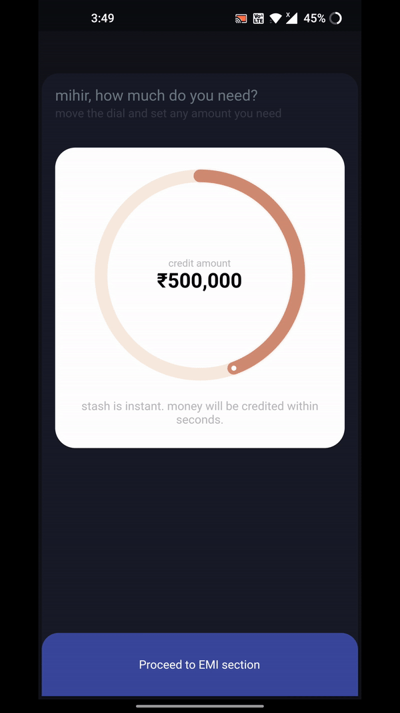

# Stax

This is a flutter application for a stack framework supporting expanded and collapsed states.

## Demo

## Project Structure

- **.screens** : All the main screens for the app goes into this package
- **.components** : All reusable widgets are stored in this package
  - **.atoms** : Atoms are completely stateless reusable components.
  - **.molecules** : Molecules are stateless but may not be reusable.
  - **.organisms** : Organisms have their own state and probably won't be used again.
- **.extentions** : These extentions helps for type conversions and simplification of code
- **.models** : All the blueprint files for the app goes into this package
- **.services** : All classes which provides additional help goes in this package

## Third party packages used in the project

- **sleek_circular_slider: ^1.2.0+web** : Used for the circular slider to display the credit amount
- **intl: ^0.16.1** : Used to convert double datatype amount to currency string

